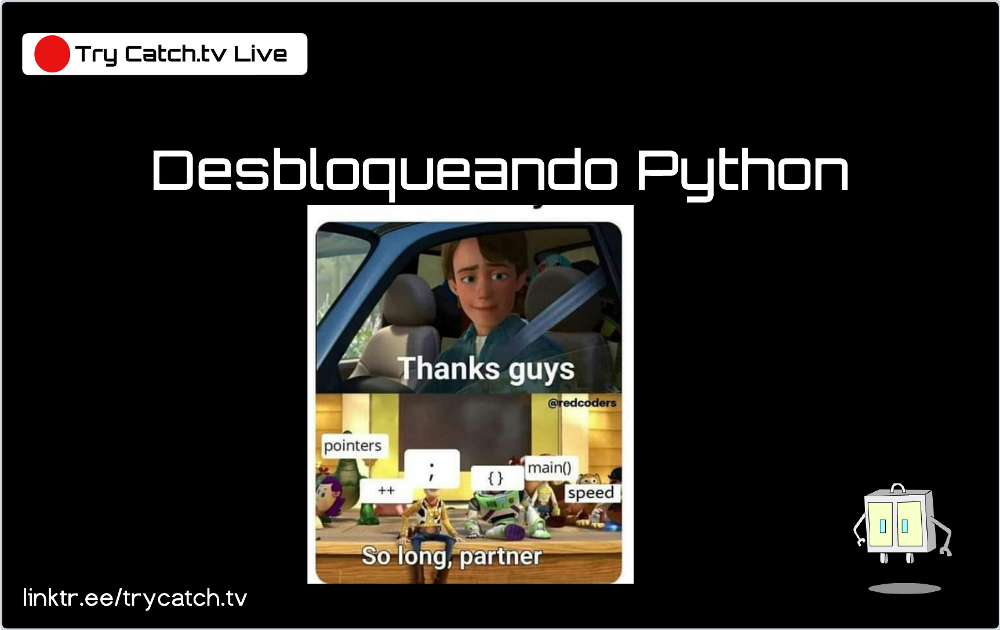

# Desbloqueando

¡Bienvenido a 'Desbloqueando'! En esta serie de transmisiones en vivo, nos sumergimos en los fundamentos de diferentes lenguajes de programación elegidos por nuestra comunidad. En cada sesión, desbloqueamos el potencial de estos lenguajes, desde la sintaxis y las convenciones, hasta la creación de aplicaciones reales. Nuestro enfoque práctico te permitirá ganar confianza y aprender a tu propio ritmo. La misión de 'Desbloqueando' es ayudarte a dominar el arte de la programación, un lenguaje a la vez. ¡Acompáñanos y empieza a desbloquear tu potencial de programación hoy!

*Click en la imagen para acceder a las notas*

## Kotlin

## Python

