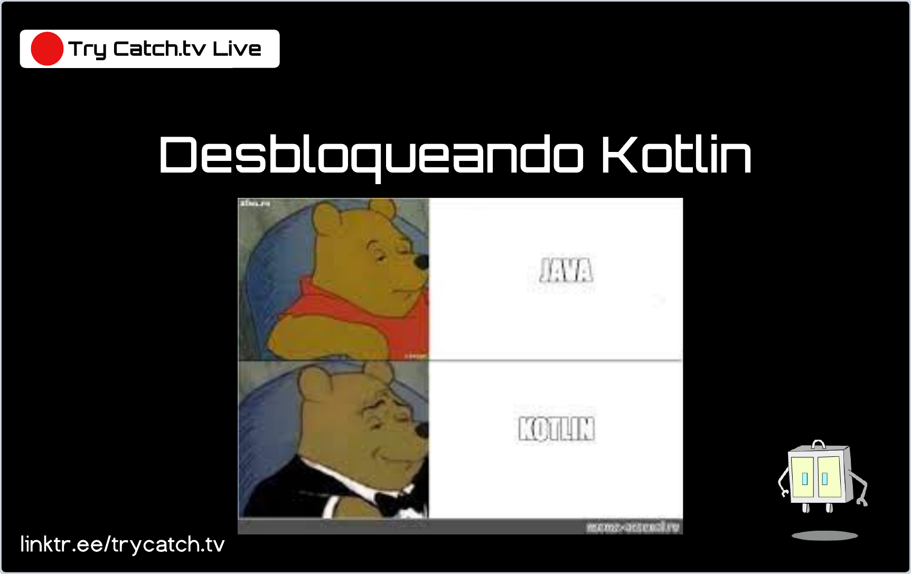

# Kotlin

¡Bienvenido a Desbloqueando Kotlin! 

Este es un espacio donde desglosamos y desmitificamos Kotlin, uno de los lenguajes de programación más utilizados y versátiles. En cada transmisión, exploraremos desde lo básico hasta los conceptos avanzados, ayudándote a descubrir y dominar las innumerables posibilidades que Python tiene para ofrecer. Independientemente de si eres un principiante absoluto o un profesional experimentado buscando afilar tus habilidades, este lugar es para ti. ¡Vamos a desbloquear Kotlin juntos!

## Notas

- [Guía](https://play.kotlinlang.org/byExample/overview)
- [Complemento](https://play.kotlinlang.org/koans/overview)

## Videos

- [Parte 1](https://youtu.be/Yz7Te06ng4U)
- [Parte 2](https://youtu.be/ADrMv1SDW5Q)
- [Parte 3](https://youtu.be/3q-h95ZnrFM)
